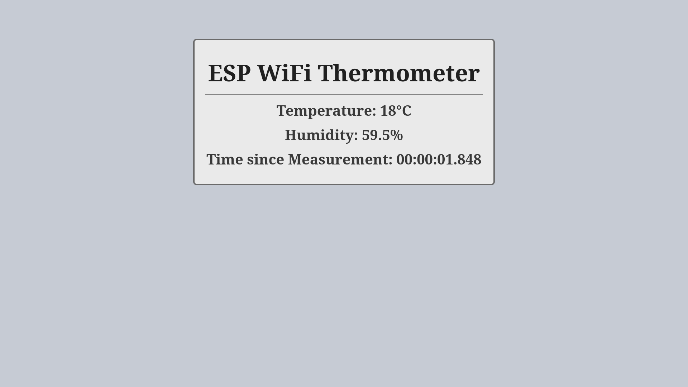

# Description
A program to measure the current temperature(and relative humidity, if supported by the sensor) using an ESP32 or ESP8266.  
This program has a default mode in which the ESP runs continuously and outputs data frequently.  
And a Deep Sleep Mode in which it is off for most of the time and outputs data less frequently.

## Web Interface  
This program shows the measurements on a simple web interface.  
This web interface updates its values every 2 seconds using javascript.  
A screenshot of the web interface:  

## Deep Sleep Mode
Deep Sleep Mode is a operating mode where the ESP pushes metrics once, and then sleeps for a predefined time.  
After that it wakes up and pushes metrics again.  
This cycle is repeated indefinitely.  
In this mode the Web Server and ArduinoOTA support are disabled.  
Note: For this to work on the ESP8266 you need to connect the GPIO 16 to the RST pin.

# Hardware support
A list of supported microcontrollers and temperature sensors.

## Microcontrollers
A list of supported microcontrollers.
 * ESP32DevKitC
 * ESP8266DevKitC

## Temperature sensors
A list of supported temperature sensors along with their required pull up resistor.  
Format: Sensor(Pull Up Resistor)
 * DHT22(10ḲΩ)
 * DS18B20(4.7KΩ)

# Requirements
 1. A supported microcontroller
 2. A supported temperature sensor
 3. The Pull Up Resistor for said sensor
 4. USB-Micro-B to USB-A cable
 5. PC with a working [platformio](https://platformio.org/) installation

# Getting Started
The steps to compile this project and flash it onto an esp.  

 * Connect your esp to your temperature sensor. Wiring for the DHT22:

    |ESP Pin       |DHT22 Pin|
    |--------------|---------|
    |5V            |VCC      |
    |5V(10KΩ),GPIO5|Data     |
    |GND           |GND      |

 * Create a wifissid.txt file containing the SSID of the wifi to connect to.
 * Create a wifipass.txt file containing the Passphrase for the wifi to connect to.
 * Create a otapass.txt file containing the password for [ArduinoOta](https://www.arduino.cc/reference/en/libraries/arduinoota/), allowing your to upload modified versions over wifi.
 * Create a mqttuser.txt file containing the username to use to connect to the MQTT broker.  
   For technical reasons this is required even if you do not use MQTT.
 * Create a mqttpass.txt file containing the password for the MWTT broker.   
   For technical reasons this is required even if you do not use MQTT.
 * Make sure these five files don't end with an empty line.
 * Attach the ESP to your PC using a USB-Micro-B to USB-A cable.
 * Build this project and flash it to the ESP by running `pio run -t upload -e esp32dev` for ESP32 or `pio run -t upload -e esp_wroom_02` for the ESP8266.
 * To upload over WiFi after this project is installed run `pio run -t upload -e esp32dev_ota` for an ESP32 or `pio run -t upload -e esp_wroom_02_ota` for an ESP8266.
 * Run `pio device monitor` to open a serial connection.
 * Wait a few seconds for the ESP to finish booting.
 * Enter `ip` and press return to get the device ip.
 * Enter the IPv4 ip(for example 192.168.2.101) returned by this into your browser to see the web interface, showing your current temperature and relative humidity.

# Integration
Information on available integrations can be found in the [integration directory](./integration/README.md).
