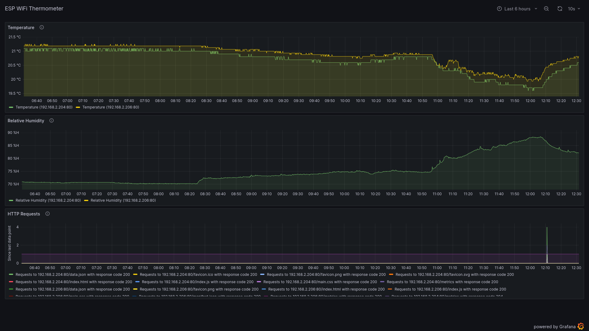

# Grafana integration
This project contains a [grafana](https://grafana.com/) dashboard to allow visualizing the [prometheus](https://prometheus.io/) metrics in [grafana](https://grafana.com/).  
The dashboard visualizes both the measurements and the web interface usage statistics.  
This is what the dashboard looks like:  

## Setup
This setup requires an already running [grafana](https://grafana.com/) instance, as well as already set up [prometheus integration](./prometheus.md), [kube-prometheus integration](./kube-prometheus.md), or [prometheus pushgateway integration](./prometheus-pushgateway.md).
 1. Open your [grafana](https://grafana.com/) instance and log in as a user with permissions to create new dashboards.
 2. Hover over the "+" on the left side of the page.
 3. Click "Import" in the dropdown that appears.
 4. Either click on "Upload JSON file" and select the [grafana-dashboard.json](./grafana-dashboard.json) file in this project.  
    Or copy the contents of [grafana-dashboard.json](./grafana-dashboard.json), paste them into the text field under "Import via panel json", and click "Load".
 5. Click "Import" on the bottom of the page.
