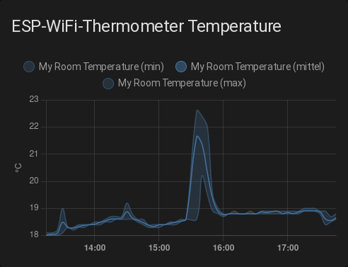

# Home Assistant integration
The [MQTT](https://mqtt.org/) integration of this project can also be used with [home-assistant](https://www.home-assistant.io/).
This can for example be used to have [home-assistant](https://www.home-assistant.io/) show graphs like these:  
  
This graph can be created with a graph with this configuration:

```yml
chart_type: line
period: 5minute
days_to_show: 30
type: statistics-graph
entities:
  - sensor.my_room_temperature
stat_types:
  - mean
  - min
  - max
title: ESP-WiFi-Thermometer Temperature
```

  
This graph can be created with this configuration:

```yml
type: gauge
entity: sensor.my_room_humidity
name: ESP-WiFi-Thermometer Humidity
max: 100
```

## Setup
This setup requires you to already have a running [home-assistant](https://www.home-assistant.io/) server, as well as a set up [mqtt integration](./mqtt.md).  
If you have already set up [home-assistant](https://www.home-assistant.io/) [MQTT](https://mqtt.org/) integration you can skip the first 9 steps.
 1. Log into your [home-assistant](https://www.home-assistant.io/) server web interface with an account with permissions to change integrations and dashboards.
 2. Click "Configuration" in the bottom left of the interface.
 3. Click "Devices & Services" near the middle of the screen.
 4. Click the "+ ADD INTEGRATION" button on the bottom right of the screen.
 5. Search for "MQTT" and click on "MQTT".
 6. Input your [MQTT](https://mqtt.org/) broker/server information(Address, Port, and if authentication is required username, and password).
 7. Click "NEXT" on the bottom right of the popup.
 8. Click "SUBMIT" on the bottom of the menu.
 9. Click "FINISH" on the confirmation window.
 10. Add sensor configuration like the one below to the sensor section of your [home-assistant](https://www.home-assistant.io/) configuration.yaml.
 11. Reload your [home-assistant](https://www.home-assistant.io/) configuration.(Easiest by restarting [home-assistant](https://www.home-assistant.io/))  
     If you already know how to add whatever you want to do with the measurements you are done after this.
 12. Open the dashboard where you want to add the measurements to.  
     This example adds a temperature graph.
 13. Click on the three dots at the top right of the screen.
 14. Click "TAKE CONTROL" to change the dashboard from an automatically configured one to a manually configured one.
 15. Click the "+ ADD CARD" button on the bottom right.
 16. Select the card you want to add.  
     For this example that is the "Statistics Graph" card.
 17. Add a title in the "Title" field near the top center of the menu.
 18. Click "Add a statistic" near the center and select the temperature sensor.
 19. Click "SAVE" at the bottom right of the menu to add the card.

**Example configuration.yaml temperature and humidity sensor:**

```yml
  - platform: mqtt
    state_topic: 'esp-wifi-thermometer/temperature'
    state_class: measurement
    name: 'ESP WiFi Thermometer Temperature'
    unit_of_measurement: '°C'

  - platform: mqtt
    state_topic: 'esp-wifi-thermometer/humidity'
    state_class: measurement
    name: 'ESP WiFi Thermometer Humidity'
    unit_of_measurement: '%'
```
